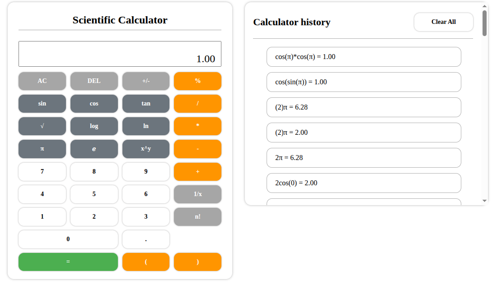

# Scientific Calculator
## Overview
This project is a Typescript-based scientific calculator that handles:
- Basic arithmetic operations: +, -, *, /, %
- Parentheses and operator precedence
- Unary operators (+, -)
- Scientific functions: sin, cos, tan, log, ln, etc.
- Constants: π and e
- Factorials and power operations
## Features
### Basic Operations
- Addition, subtraction, multiplication, division
- Handles parentheses for proper precedence
- Supports unary positive and negative numbers
```javascript
-5 + (3*2) → 1
```
### Scientific Functions
- sin(x), cos(x), tan(x)
- Logarithms: log(x) (base 10), ln(x) (natural log)
- Factorials: 5! → 120
- Powers: 2^3 → 8
```javascript
cos(0) + 1 → 2
sin(π/2)(2+3) → 5
```
### Implicit Multiplication
The calculator supports expressions like:
```javascript
(2+3)4 → 20
2π → 6.283...
```
### History
- Every calculation is stored in the browser's localStorage
- Users can view past calculations even after page reload
- History is updated dynamically as calculations are performed
## Type System
This project leverages TypeScript for better maintainability and safety.
### Custom Types
```typescript
export type strOrNum = string | number
export type priorityType = -1 | 1 | 2 | 3 | 4
```
### Scientific Types
```typescript
export type scientificArr = ["sin", "cos", "tan", "log", "ln", "sqrt"]
export type scientificOp = scientificArr[number]
```
## Core Interfaces
### Stack Interface
```typescript
export interface IStack {
    resiprocal(str: string): number | null
    tokenGenerator(str: string): strOrNum[]
    postfix(arr: strOrNum[]): strOrNum[]
    evaluatePostfix(arr: strOrNum[]): number
    toggleSign(arr: strOrNum[]): strOrNum[] | string
}
```
### History Interface
```typescript
export interface IHistory {
    appendHistory(exp: string, val: number): void 
    loadLocal(): void 
}
```
## Folder Structure
```
ts-calculator/
│
├─ src/
│   ├─ app.ts
│   ├─ stack.ts
│   ├─ history.ts
│   ├─ types.ts
│   └─ utils.ts   
|
├─ public/
|   ├─ 
|   ├─ index.html       
|   └─ style.css  
├─ package.json
├─ tsconfig.json
├─ .gitignore      
└─ README.md        
```
## Screenshot:
